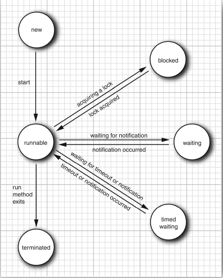
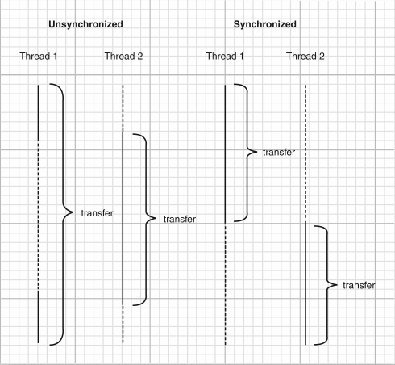

# 并发
> 操作系统中的多任务(multitasking)：在同一刻运行多个程序的能力。
>
> 多线程在较低的层次上扩展了多任务的概念：一个程序同时执行多个任务。
> 通常，每一个任务称为一个线程(thread)，它是线程控制的简称。
> 可以运行一个以上线程的程序称为多线程程序(multithreaded)。

多线程与多进程的区别：
- 本质的区别在于每个进程拥有自己的一整套变量，而线程则共享数据。
- 与进程相比，线程更 “轻量级”，创建、撤销一个线程比启动新的进程的开销要小得多。

-----------------------------------------------

在一个单独的线程中执行一个任务的简单过程：
1. 将任务代码移到实现了 Runnable 接口的类的 run 方法中。这个接口非常简单，只有一个方法：
    ```java
   public interface Runnable {
       void run();
   }
   ```
   由于 Runnable 是一个函数式接口，可以用 lambda 表达式建立一个实例：
   ```
    Runnable r = () -> { task code };
    ```
2. 由 Runnable 创建一个 Thread 对象：
    ```
    Thread t = new Thread(r);
    ```
3. 启动线程：
    ```
   t.start();
   ```

### 中断线程
> 当线程中的 run 方法执行方法体中最后一条语句后，并经由执行 return 语句返回时，
> 或者返回了在方法中没有捕获的异常时，线程将终止。

> 没有可以强制线程终止的方法。
> 然而，interrupt 方法可以用来请求终止线程。
>
> 当对一个线程调用 interrupt 方法时，线程的中断状态将被置位。
> 这是每一个线程都具有的 boolean 标志。
> 每个线程都应该不时地检查这个标志，以判断线程是否被中断。
```
Thread.currentThread().isInterrupted()
```
> 但是，如果线程被阻塞，就无法检测中断状态。
> 这是产生 InterruptedException 异常的方法。
> 当在一个被阻塞的线程(调用 sleep 或 wait)上调用 interrupt 方法时，
> 阻塞调用将会被 Interrupted Exception 异常中断。
>
> 中断一个线程不过是引起它的注意。被中断的线程可以决定如何响应中断。
> 某些线程是如此重要以至于应该处理完异常后，继续执行，而不理会中断。

-------------------------------------------
> interrupted 和 isInterrupted 是两个非常类似的方法。
> interrupted 方法是一个静态方法，它检测当前的线程是否被中断。而且，调用 interrupted 方法会清除该线程的中断状态。
> isInterrupted 方法是一个实例方法，可用来检测是否有线程被中断。调用这个方法不会改变中断状态。

### 线程状态
- New (新创建)
> 当用 new 操作符创建一个新线程时，如 new Thread(r)，该线程还没有开始运行。这意味着它的状态是 new。
> 当一个线程处于新创建状态时，程序还没有开始运行线程中的代码。

- Runnable (可运行)
> 一旦调用 start 方法，线程就处于 Runnable 状态。
> 一个Runnable 的线程可能正在运行也可能没在运行，这取决于操作系统给线程提供的运行时间。

- Blocked (被阻塞)
- Waiting (等待)
- Timed waiting (计时等待)
    - 当一个线程企图获取一个内部的对象锁，而该锁被其他线程持有，则该线程进入阻塞状态。
        当所有其它线程释放该锁，并且线程调度器允许本线程持有它的时候，该线程将变成非阻塞状态。
    - 当线程等待另一个线程通知调度器条件时，它自己进入等待状态。
    - 有几个方法有一个超时参数。调用它们导致线程进入计时等待状态。
        这一状态将一直保持到超时期满或者接收到适当的通知。
> 当线程处于被阻塞或等待状态时，它暂时不活动。它不运行任何代码且消耗最少的资源。
> 直到线程调度器重新激活它。

- Terminated (被终止)
    - 因为 run 方法正常退出而自然死亡。
    - 因为一个没有捕获的异常终结了 run 方法而意外死亡。


## 线程属性
### 线程的优先级
> 在 Java 程序设计语言中，每一个线程有一个优先级。
> 默认情况下，一个线程继承它的父线程的优先级。
> 可以用 setPriority 方法提高或降低任何一个线程的优先级。
> 可以将优先级设置为 MIN_PRIORITY (在 Thread 类中定义为 1 ) 与
> MAX_PRIORITY(定义为 10 ) 之间的任何值。
> 
> 线程优先级是高度依赖于系统的。

> 不要将程序构建为功能的正确性依赖于优先级。

### 守护线程
可以通过调用 `t.setDaemon(true)`将线程转换为守护线程(daemon thread)。
> 守护线程的唯一用途是为其他线程提供服务。
> 当只剩下守护线程时，虚拟机就退出了。

> 守护线程应该永远不去访问固有资源，如文件、数据库等，
> 因为它会在任何时候甚至在一个操作的中间发生中断。

### 未捕获异常处理器

----------------------------------------------
## 同步
### 锁对象
> 有两种机制防止代码块受到并发访问的干扰。
> Java 语言提供了一个 synchronized 关键字达到这一目的，
> 并且 Java SE 5.0 引入了 ReentrantLock 类。

用 ReentrantLock 保护代码的基本结构如下：
```
myLock.lock(); // a ReentrantLock object
try {
    critical section
} finally {
    myLock.unlock(); // make sure the lock is unlocked even if an exception is thrown
}
```
> 这一结构确保任何时刻只有一个线程进入临界区。一旦一个线程封锁了锁对象，其他任何线程都无法通过 lock 语句。
> 当其他线程调用 lock 时，它们被阻塞，直到第一个线程释放锁对象。

> CAUTION:It is critically important that the unlock operation is enclosed in a finally
  clause. If the code in the critical section throws an exception, the lock must be
  unlocked. Otherwise, the other threads will be blocked forever.



> ReentrantLock 是可重入的，因为线程可以重复地获取已经获得的锁。
> 锁保持一个持有计数(hold count)来跟踪对 lock 方法的嵌套调用。
> 线程在每一次调用 lock 都要调用 unlock 来释放锁。
> 由于这一特性，被一个锁保护的代码可以调用另一个使用相同的所锁的方法。

> 通常，可能想要保护需若干个操作来更新或检查共享对象的代码块。
> 要确保这些操作完成后，另一个线程才能使用相同对象。

### 条件对象
> 一个锁对象可以有一个或多个相关的条件对象。
> 可以用 newCondition 方法获得一个条件对象。
```
class Bank{
    private Condition sufficientFunds;
    . . .
    public Bank() {
        . . .
        sufficientFunds = bankLock.newCondition();
    }
}
```
如果 transfer 方法发现余额不足，它调用
```
sufficientFunds.await();
```
当前线程现在被阻塞了，并放弃了锁。
> 等待获得锁的线程和调用 await 方法的线程存在本质的不同。
> 一旦一个线程调用 await 方法，它进入该条件的等待集。
> 当锁可用时，该线程不能马上解锁阻塞。
> 相反，它处于阻塞状态，直到另一个线程调用同一条件上的 signalAll 方法时为止。

当另一个线程转账时，它应该调用：
```
sufficientFunds.signalAll();
```
> 这一调用重新激活因为这一条件而等待的所有线程。
> 当这些线程从等待集当中移出时，它们再次成为可运行的，调度器将再次激活它们。

### synchronized 关键字
有关锁和条件的关键之处：
- 锁用来保护代码片段，任何时刻只能有一个线程执行被保护的代码。
- 锁可以管理试图进入被保护代码段的线程。
- 锁可以拥有一个或多个相关的条件对象。
- 每个条件对象管理那些已经进入被保护的代码段但还不能运行的线程。

> 如果一个方法用 synchronized 关键字声明，那么对象的锁将保护整个方法。
```
public synchronized void method() {
    method body
}
```
等价于
```
public void method() {
    this.intrinsicLock.lock();
    try {
        method body
    } finally { 
        this.intrinsicLock.unlock();
    }
}
```
> 内部对象锁只有一个相关条件。wait 方法添加一个线程到等待集合，
> notifyAll / notify 方法解除等待线程的阻塞状态。

内部锁和条件存在一些局限：
- 不能中断一个正在试图获得锁的线程。
- 试图获得锁时不能设定超时。
- 每个锁仅有单一的条件，可能是不够的。

### 同步阻塞
```
// this is the syntax for a synchronized block
synchronized (obj) { 
    critical section
}
```

### 监视器概念
监视器具有如下特性：
- 监视器是只包含私有域的类。
- 每个监视器类的对象有一个相关的锁。
- 使用该锁对所有的方法进行加锁。
- 该锁可以有任意多个相关条件。

### Volatile 域
> volatile 关键字为实例域的同步访问提供了一种免锁机制。
> 如果声明一个域为 volatile，那么编译器和虚拟机就知道该域是可能被另一个线程并发更新的。

### final 变量

### 原子性
>  java.util.concurrent.atomic 包中有很多类使用了很高效的机器级指令来保证其他操作的原子性。

> 如果有大量线程要访问相同的原子值，性能会大幅下降，因为乐观更新需要太多次重试。
> 
> 如果认为可能存在大量竞争，只需要使用 LongAdder 而不是 AtomicLong。

### 死锁

### 线程局部变量
> 有时可能要避免共享变量，使使用 ThreadLocal 辅组类为各个线程提供各自的实例。

例如，SimpleDateFormat 类不是线程安全的。
假设就有一个静态变量：
```
public static final SimpleDateFormat dateFormat = new SimpleDateFormat("yyyy-MM-dd");
```
如果两个线程都执行以下操作：
```
String dateStamp = dateFormat.format(new Date());
```
结果可能很混乱，因为 dateFormat 使用的内部数据结构可能会被并发的访问所破坏。
可以使用同步，但开销很大；或则可以在需要时构造一个局部 SimpleDateFormat 对象，不过这也太浪费了

要为每一个线程构造一个实例，可以使用以下代码：
```
public static final ThreadLocal<SimpleDateFormat> dateFormat =
    ThreadLocal.withInitial(() -> new SimpleDateFormat("yyyy-MM-dd"));
```
要访问具体的格式化方法，可以调用：
```
String dateStamp = dateFormat.get().format(new Date());
```
在一个给定线程中首次调用 get 时，会 调用 initialValue 方法。
在此之后，get 方法会返回属于当前线程的那个实例。

### 锁测试与超时
线程在调用 lock 方法来获得另一个线程所持有的锁的时候，很可能发生阻塞。
应该更加谨慎地申请锁。tryLock 方法试图申请一个锁，在成功获得锁后返回 true，
否则，立刻放回 false，而且线程可以立即离开去做其他事情。
```
if (myLock.tryLock()) {
    // now the thread owns the lock
    try { . . . }
    finally { myLock.unlock(); }
} else {
    // do something else
}
```
可以在调用 tryLock 时，使用超时参数，像这样：
```
if (myLock.tryLock(100, TimeUnit.MILLISECONDS)) . . .
```
TimeUnit 是一个枚举类型，可以取的值包括
SECONDS, MILLISECONDS, MICROSECONDS 和 NANOSECONDS

### 读/写锁
如果有很多线程从一个数据结构读取数据而只有很少的线程会修改其中的数据的话，
使用 ReentrantReadWriteLock 类是十分有用的。

使用读写锁的必要步骤：
1. 构造一个 ReentrantReadWriteLock 对象
    ```
    private ReentrantReadWriteLock rwl = new ReentrantReadWriteLock();
    ```
2. 抽取读锁和写锁：
    ```
    private Lock readLock = rwl.readLock();
    private Lock writeLock = rwl.writeLock();
    ```
3. 对所有的获取方法加读锁：
    ```
    public double getTotalBalance() {
        readLock.lock();
        try { . . . }
        finally { readLock.unlock(); }
    }
    ```

4. 对所有的修改方法加写锁：
    ```
    public void transfer(. . .) {
        writeLock.lock();
        try { . . . }
        finally { writeLock.unlock(); }
    }
   ```

### 为什么弃用 stop 和 suspend 方法
stop 方法天生就不安全，suspend 方法会经常导致死锁。

----------------------------------------------
## 阻塞队列
> 对于许多线程问题，可以通过使用一个或多个队列以优雅且安全的方式将其形式化。
> 生产者线程向队列插入元素，消费者线程则取出它们。
> 使用队列，可以安全地从一个线程向另一个线程传递数据。

> 当试图向队列添加元素而队列已满，或是想从队列移出元素而队列为空的时候，
> 阻塞队列(blocking queue)导致线程阻塞。

## 线程安全的集合

--------------------------------------------
## Callable 与 Future
> Runnable 封装了一个异步的任务，可以把它想象成为一个没有参数和返回值的异步方法。
> Callable 与 Runnable 类似，但是有返回值。

Callable 接口是一个参数化的类型，只有一个方法 call。
```java
public interface Callable<V> {
    V call() throws Exception;
}
``` 
类型参数是返回值的类型。
例如，Callable<Integer> 表示一个最终返回 Integer 对象的异步计算。

Future 保存异步计算的结果。
可以启动一个计算，将 Future 对象交给某个线程，然后忘掉它。
Future 对象的所有者在结果计算好之后就可以获得它。
```
public interface Future<V> {
    V get() throws . . .;
    V get(long timeout, TimeUnit unit) throws . . .;
    void cancel(boolean mayInterrupt);
    boolean isCancelled();
    boolean isDone();
}
```
第一个 get 方法的调用被阻塞，直到计算完成。
如果在计算完成之前，第二个方法的调用超时，抛出一个 TimeoutException 异常。
如果运行该计算的线程被中断，两个方法都将抛出 InterruptedException 异常。
如果计算已经完成，那么 get 方法立即返回。

如果计算还在进行，isDone 方法返回 false；如果完成了，则返回true。

可以用 cancel 方法取消该计算。如果计算还没有开始，他被取消且不再开始。
如果计算处于运行之中，那么如果 mayInterrupt 参数为 true，他就被中断。

> FutureTask 包装器是一种非常便利的机制，
> 可将 Callable 转换成 Future 和 Runnable， 它同时实现两者的接口。
```
Callable<Integer> myComputation = . . .;
FutureTask<Integer> task = new FutureTask<Integer>(myComputation);
Thread t = new Thread(task); // it's a Runnable
t.start();
. . .
Integer result = task.get(); // it's a Future
```

## 执行器
> 如果程序中创建了大量的生命期很短的线程，应该使用线程池(thread pool)。
> 一个线程池中包含许多准备运行的空闲线程。
> 将 Runnable 对象交给线程池，就会有一个线程调用 run 方法。
> 当 run 方法退出时，线程不会死亡，而是在池中准备为下一个请求提供服务。

> 另一个使用线程池的理由是减少并发线程的数量。创建大量线程会大大降低性能甚至使虚拟机崩溃。

### 线程池
在使用连接池时应该做的事：
1. 调用 Executors 类中静态的方法 newCachedThreadPool 或 newFixedThreadPool。
2. 调用 submit 提交 Runnable 或 Callable 对象。
3. 如果想要取消一个任务，或如果提交 Callable 对象，那就要保存好返回的 Future 对象。
4. 当不再提交任何任务时，调用 shutdown。

### 预定执行
> ScheduledExecutorService 接口具有预定执行(Scheduled Execution)或重复执行任务而设计的代码。
它是一种允许使用线程池机制的 java.util.Timer 的泛化。 
> Executors 类的newScheduledThreadPool 和 newSingleThreadScheduledExecutor
方法将返回实现了 ScheduledExecutorService 接口的对象。

### Fork-Join 框架

### 可完成 Future

---------------------------------------------------------
## 同步器
### 信号量
### 倒计时门栓
### 障栅
### 交换器
### 同步队列


