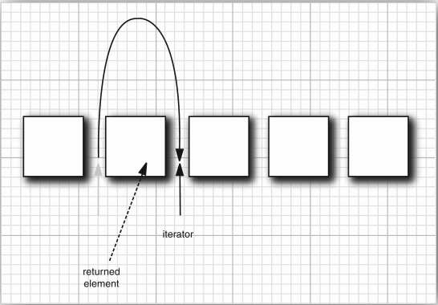
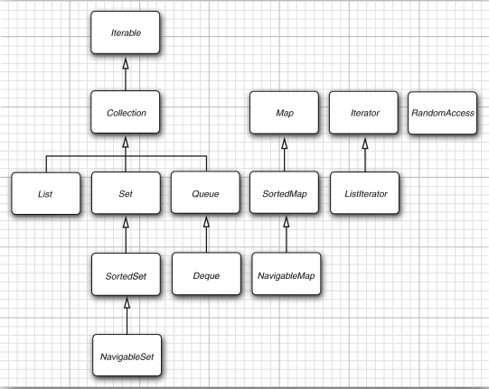
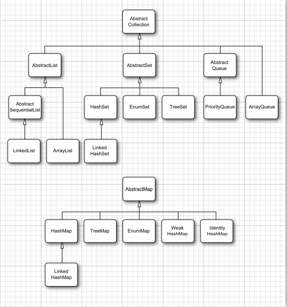

# 集合

## Java集合框架

### 将集合的接口与实现分离

### Collection 接口
> 在 Java 类库中，集合类的基本接口是 Collection 接口。
> 这个接口有两个基本方法
```
public interface Collection<E> {
    boolean add(E element);
    Iterator<E> iterator();
    . . .
}
```

### 迭代器
Iterator 接口包含 4 个方法：
```
public interface Iterator<E>{
    E next();
    boolean hasNext();
    void remove();
    default void forEachRemaining(Consumer<? super E> action);
}
```
> 通过反复调用 next 方法，可以逐个访问集合中的每个元素。
> 但是，如果到了集合的末尾，next 方法将抛出一个 NoSuchElementException。
> 因此，需要在调用 next 之前调用 hasNext 方法。
> 如果迭代器对象还有多个供访问的元素，这个方法就返回 true。

> Java 集合类库中的迭代器与其他类库中的迭代器在概念上有着重要的区别。
> Java 迭代器查找操作与位置变更是紧密相连的。查找一个元素的唯一的方法是调用 next，
> 而在执行查找操作的同时，迭代器的位置随之向前移动。
>
> 应该将 Java 迭代器认为是位于连个元素之间。当调用 next 时，迭代器就越过一个元素，
> 并返回刚刚越过的那个元素的引用。


> Iterator 接口的 remove 方法将会删除上次调用 next 方法时返回的元素。

> 对 next 方法和 remove 方法的调用具有互相依赖性。
> 如果调用 remove 前没有调用 next 将是不合法的。
> 如果这样做，将会抛出一个 IllegalStateException 异常。 
 
### 集合框架中的接口

> 接口有两个基本接口：Collection 和 Map

可以用以下方法在集合中插入元素：
```
boolean add(E element)
```
不过，由于 Map 包含 键 / 值 对，所以要用 put 方法来插入：
```
V put(K key, V value)
```
要从集合中读取元素，可以用迭代器访问元素。
不过，从 Map 中读取值则要使用 get 方法：
```
V get(K key)
```

## 具体的集合


## 映射
> 映射(map)用来存放 键/值 对。如果提供了键，就能够找到值。

### 映射视图
> 集合框架不认为映射本身是一个集合。
> 不过，可以得到映射的视图(view)——这是实现了 Collection 接口或某个子接口的对象。

> 有三种视图：键集(Set)，值集合(Collection)以及 键/值对 集(Set)。
> 可以用下面的方法获得：
```
Set<K> keySet()
Collection<V> values()
Set<Map.Entry<K, V>> entrySet()
```
> 如果在键集视图上调用迭代器的 remove 方法，实际上会从映射中删除这个键值对。
> 不过，不能向键集视增加元素。