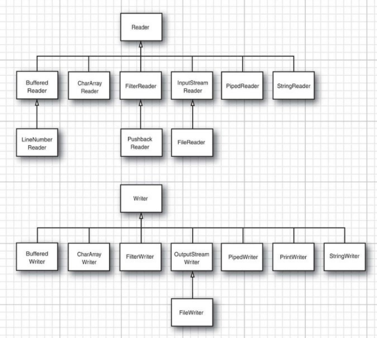
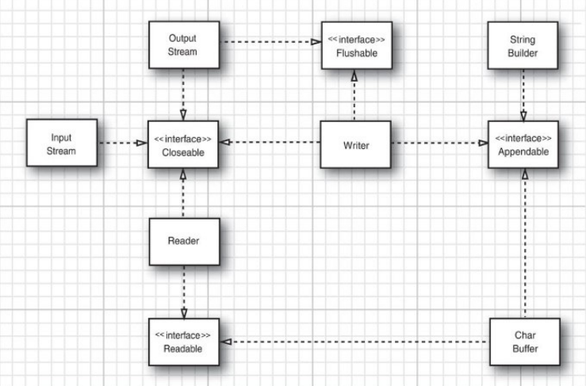
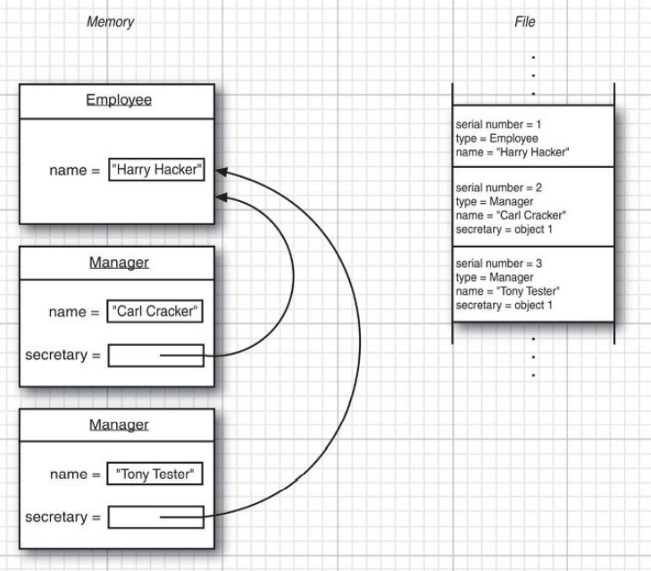
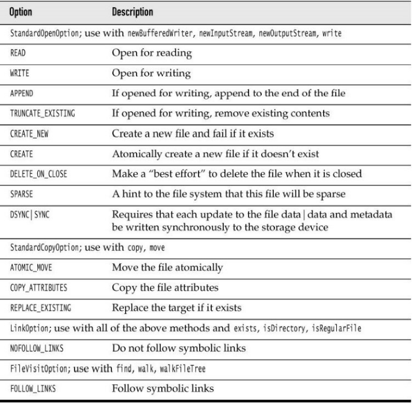
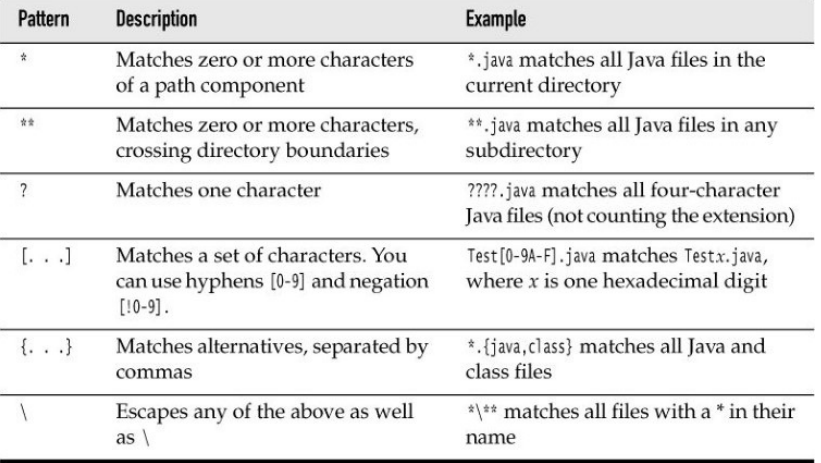
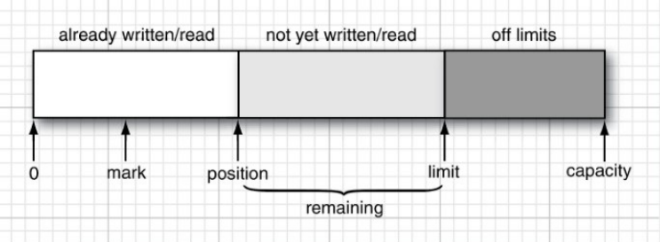

# 输入输出

## 输入/输出流

> 抽象类 InputStream 和 OutputStream 构成输入 / 输出(I/O)类层次结构的基础。

### 读写字节

```
abstract int read()
abstract void write(int b)
```

### 完整的流家族






### 组合输入输出流过滤器

> 可以通过嵌套过滤器来添加多重功能

## 文本输入与输出

```
// PrintWriter out = new PrintWriter("employee.txt", "UTF-8");
PrintWriter out = new PrintWriter(
    new FileOutputStream("employee.txt"), "UTF-8");

// 用于读取较短的文件
String content = new String(Files.readAllBytes(path), charset);
// 将文件一行一行的读入
List<String> lines = Files.readAllLines(path, charset);
// 如果文件太大，可以将行惰性处理为一个 Stream<String> 对象。
try (Stream<String> lines = Files.lines(path, charset)) {
    . . .
}
```

## 读写二进制数据

### DataInput 和 DataOutput 接口

DataInput 接口定义了下面用于以二进制格式写数组、字符、boolean 值和字符串的方法：

```
// 写出一个给定类型的值
void writeBoolean(boolean b)
void writeByte(int b)
void writeChar(int c)
void writeDouble(double d)
void writeFloat(float f)
void writeInt(int i)
void writeLong(long l)
void writeShort(int s)

// 写出字符串中的所有字符
void writeChars(String s)

// 写出由 “修订过的 UTF-8” 格式的字符构成的字符串
void writeUTF(String s)
```

DataOutput 接口定义了下列读回数据的方法：

```
// 读取一个给定类型的值
boolean readBoolean()
byte readByte()
char readChar()
double readDouble()
float readFloat()
int readInt()
long readLong()
short readShort()

/**
 * 将字节读入到数组 b 中，期间阻塞直至所有字节都读入
 * @param b 数据读入的缓冲区
 */
void readFully(byte[] b)

/**
 * 将字节读入到数组 b 中，期间阻塞直至所有字节都读入
 * @param b     数据读入的缓冲区
 * @param off   数据起始位置的偏移量
 * @param len   读入字节的最大数量
 */
void readFully(byte[] b, int off, int len)

// 读入由 “修订过的 UTF-8” 格式的字符构成的字符串
String readUTF()

/**
 * 跳过 n 个字节，期间阻塞直至所有字节都被跳过
 * @param n 被跳过的字节数
 */
int skipBytes(int n)
```

### 随机访问文件(RandomAccessFile)

RandomAccessFile 类可以在文件中的任何位置查找或写入数据。
磁盘文件都是随机访问的，
可以打开一个随机访问文件，并可以通过指定 "r"(只读) 或 "rw"(读写访问) 模式

```
RandomAccessFile in = new RandomAccessFile("employee.dat", "r");
RandomAccessFile inOut = new RandomAccessFile("employee.dat", "rw");
```

> 随机访问文件有一个表示下一个将被读入或写出的字节所处位置的文件指针，
> seek 方法可以用来将这个文件指针设置到文件中的任意字节位置。

```
/**
 * 构造函数
 * @param file 要打开的文件
 * @param mode "r"  表示只读模式
               "rw" 表示读/写模式
               "rws"表示每次更新时，都对数据和元数据的写磁盘操作进行同步的读/写
               "rwd"表示每次更新时，只对数据的写磁盘操作进行同步的读/写
 */
RandomAccessFile(String file, String mode)
RandomAccessFile(File file, String mode)

// 返回文件指针的当前位置
long getFilePointer()

// 将文件指针设置到距文件开头 pos 个字节处
void seek(long pos)

// 返回文件按照字节来度量的长度
long length()
```

### ZIP 文档

## 对象输入 / 输出流与序列化

### 保存和加载序列化对象

> 每个对象都是用一个序列号(serial number)保存的，这就是这种机制之所以被称为对象序列化的原因。

下面是其序列化对象时的算法

- 对你遇到的每一个对象引用都关联一个序列号。
- 对于每个对象，当第一次遇到时，保存其对象数据到输出流中。
- 如果某个对象之前已经被保存过，那么只写出 “与之前保存过的序列号为 x 的对象相同”。
  

在读回对象时，整个过程是反过来的：

- 对于对象输入流中的对象，在第一次遇到其序列号时，构建它，并使用流中数据来初始化它，
  然后记录这个序列号与新对象之间的关联。
- 当遇到 “与之前保存过的序列号为 x 的对象相同” 的标记时，
  获取与这个序列号相关联的对象引用

```
/* java.io.ObjectOutputStream */

// 构造一个 ObjectOutputStream 使你可以将对象写到制定的 OutputStream
ObjectOutputStream(OutputStream out)

// 写出指定的对象到 ObjectOutputStream
// 这个方法将存储指定对象的类、类的签名以及这个类及其超类中所有非静态和非瞬时的域的值。
void writeObject(Object obj)
```

```
/* java.io.ObjectInputStream */

// 创建一个 ObjectInputStream 用于从指定的 InputStream 中读回对象信息。
ObjectInputStream(InputStream in)

// 从 ObjectInputStream 中读入一个对象。
// 特别是，这个方法会读回对象的类、类的签名以及这个类及其超类中的所有非静态和非瞬时的域的值。
// 它执行的反序列化允许恢复多个对象引用。
Object readObject()
```

### 理解对象序列化的文件格式

- 对象流输出中包含所有对象的类型和数据域。
- 每个对象都被赋予一个序列号。
- 相同对象的重复出现将被存储为对这个对象的序列号的引用。

### 修改默认的序列化机制

> Certain data fields should never be serialized—for example, integer values that store file
> handles or handles of windows that are only meaningful to native methods. Such information
> is guaranteed to be useless when you reload an object at a later time or transport it to a
> different machine. In fact, improper values for such fields can actually cause native methods
> to crash.

将不可序列化的类标记为 transient 的。

```
public class LabeledPoint implements Serializable {
    private String label;
    private transient Point2D.Double point;
    . . .
}
```

> 序列化机制为单个的类提供了一种方式，去向默认的读写行为添加验证或任何其他想要的行为。

可序列化的类可以定义具有下列签名的方法：

```
private void readObject(ObjectInputStream in)
throws IOException, ClassNotFoundException;
private void writeObject(ObjectOutputStream out)
throws IOException;
```

之后，数据域就不会被自动序列化，取而代之的是调用这些方法。

### 序列化单例和类型安全的枚举

### 版本管理

### 为克隆使用序列化

## 操作文件

### Path

> A Path is a sequence of directory names, optionally followed by a file name. The first
> component of a path may be a root component such as / or C:\. The permissible root
> components depend on the file system. A path that starts with a root component is absolute.
> Otherwise, it is relative.

```
Path absolute = Paths.get("/home", "harry");
Path relative = Paths.get("myprog", "conf", "user.properties");
```

静态的 Paths.get 方法接受一个或多个字符串，并将它们用默认文件系统的路劲分隔符连接起来。
然后解析连接起来的结果，如果其表示的不是给定文件系统中的合法路劲，那么就抛出 InvalidPathException 异常。
这个连接起来的结果就是一个 Path 对象。

```
/* java.noi.file.Path */

// 如果 other 是绝对路径，那么就返回 other；
// 否则，返回通过连接 this 和 other 获得的路劲
Path resolve(Path other)
Path resolve(String other)

// 如果 other 是绝对路劲，那么就返回 other；
// 否则， 返回通过连接 this 的父路劲和 other 获得的路劲
Path resolveSibling(Path other)
Path resolveSibling(String other)

// 返回用 this 进行解析，相当于 other 的相对路径
Path relativize(Path other)

// 移除诸如 . 和 .. 的冗余的路劲元素
Path normalize()

// 返回与该路径等价的绝对路径
Path toAbsolutePath()

// 返回父路径，或者在该路径没有父路径时返回 null
Path getParent()

// 返回该路径的最后一个部件，或者在该路径没有任何部件时，返回 null
Path getFileName()

// 返回该路劲的根部件，或者在该路径没有任何根部件时，返回 null
Path getRoot()

// 从该路径创建一个 File 对象
 toFile()
```

### 读写文件

Files 类可以使普通文件操作变得快捷。

```
/* java.noi.file.Files */

// 读入文件的内容
static byte[] readAllBytes(Path path)
static List<String> readAllLines(Path path, Charset charset)

// 将给定内容写出到文件中，并返沪 Path
static Path write(Path path, byte[] contents, OpenOption... options)
static Path write(Path path, Iterable<? extends CharSequence> contents,
                OpenOption options)

// 打开一个文件，用于读入或写出
static InputStream newInputStream(Path path, OpenOption... options)
static OutputStream newOutputStream(Path path, OpenOption... options)
static BufferedReader newBufferedReader(Path path, Charset charset)
static BufferedWriter newBufferedWriter(Path path, Charset charset,
                OpenOption... options)
```

### 创建文件和目录

```
/* java.nio.file.Files */

/**
 * 创建一个空文件
 * 如果文件已经存在，那么这个调用就会抛出异常。
 * 如果文件不存在，该文件就会被创建，并且其他程序在此过程中是无法执行文件创建操作的
 */
static Path createFile(Path path, FileAttribute<?>... attrs)

// 创建新目录，其中，路劲除最后一个部件外，其他部分都必须是已存在的
static Path createDirectory(Path path, FileAttribute<?>... attrs)

// 递归式的创建新目录，可以创建中间路劲
static Path createDirectories(Path path, FileAttribute<?>... attrs)

// 用来在给定位置或者系统指定位置创建临时文件或临时目录
static Path createTempFile(String prefix, String suffix, FileAttribute<?>...attrs)
static Path createTempFile(Path parentDir, String prefix, String suffix,
            FileAttribute<?>... attrs)
static Path createTempDirectory(String prefix, FileAttribute<?>... attrs)
tatic Path createTempDirectory(Path parentDir, String prefix,
            FileAttribute<?>... attrs)
```

### 复制、移动和删除文件

```
/* java.noi.file.Files */

// 从 from 复制或移动到给定位置，并返回 to
static Path copy(Path from, Path to, CopyOption... options)
static Path move(Path from, Path to, CopyOption... options)

// 从输入流复制到文件中，或者从文件复制到输出流中，返回复制的字节数
static long copy(InputStream from, Path to, CopyOption... options)
static long copy(Path from, OutputStream to, CopyOption... options)

// 删除给定文件或空目录。
// 方法一在文件或目录不存在的情况下抛出异常
// 方法二在文件或目录不存在的情况下返回 false
static void delete(Path path)
static boolean deleteIfExists(Path path)
```



### 获取文件信息

```
/* java.noi.file.Files */

// 检查由路劲指定的文件的给定属性
static boolean exists(Path path)
static boolean isHidden(Path path)
static boolean isReadable(Path path)
static boolean isWritable(Path path)
static boolean isExecutable(Path path)
static boolean isRegularFile(Path path)
static boolean isDirectory(Path path)
static boolean isSymbolicLink(Path path)

// 获取文件按字节数度量的尺寸
static long size(Path path)

// 读取类型为 A 的文件属性
A readAttributes(Path path, Class<A> type, LinkOption... options)
```

### 访问目录中的项

静态的 Files.list 方法会返回一个可以读取目录中各个项的 Stream<Path> 对象。

```
try (Stream<Path> entries = Files.list(pathToDirectory)) {
    . . .
}
```

list 方法不会进入子目录。
如果要处理目录中的所有子目录，需要使用 Files.walk 方法

```
try (Stream<Path> entries = Files.walk(pathToRoot)) {
    // Contains all descendants, visited in depth-first order
}
```

如果想限制访问的树的深度，可以调用 `Files.walk(pathToRoot, depth)` 方法。

### 使用目录流

如果要对目录的遍历过程进行更加细粒度的控制，
应该使用 Files.newDirectoryStream 对象，它会产生一个 DirectoryStream。
它是 Iterable 的子接口，是专门用于目录遍历的接口。

```
try (DirectoryStream<Path> entries = Files.newDirectoryStream(dir)){
    for (Path entry : entries) {
        Process entries
    }
}
```

可以使用 glob 模式来过滤文件：

```
try (DirectoryStream<Path> entries = Files.newDirectoryStream(dir, "*.java"))
```



如果想要访问某个目录的子孙成员，可以调用 walkFileTree 方法，
并向其传递一个 FileVisitor 类型的对象，这个对象会得到下列通知：

- 在遇到一个文件或目录时：FileVisitResult visitFile(T path, BasicFileAttributes attrs)
- 在一个目录被处理前： FileVisitResult preVisitDirectory(T dir, IOException ex)
- 在一个目录被处理后： FileVisitResult postVisitDirectory(T dir, IOException ex)
- 在试图访问文件或目录时发生错误，例如没有权限打开目录：
  FileVisitResult visitFileFailed(T path, IOException ex)

对于上述每种情况，都可以指定是否希望执行下面的操作：

- 继续访问下一个文件：FileVisitResult.CONTINUE
- 继续访问，但是不再访问这个文件的这个目录下的任何项了：FileVisitResult.SKIP_SUBTREE
- 继续访问，但是不在访问这个文件的兄弟文（和该文件在同一目录下的文件）：
  FileVisitResult.SKIP_SIBLINGS
- 终止访问： FileVisitResult.TERMINATE

```
Files.walkFileTree(Paths.get("/"), new SimpleFileVisitor<Path>() {
    public FileVisitResult preVisitDirectory(Path path, BasicFileAttributes attrs) throws IOException {
        System.out.println(path);
        return FileVisitResult.CONTINUE;
    }

    public FileVisitResult postVisitDirectory(Path dir, IOException exc) {
        return FileVisitResult.CONTINUE;
    }

    public FileVisitResult visitFileFailed(Path path, IOException exc) throws IOException {
        return FileVisitResult.SKIP_SUBTREE;
    }
});
```

我们需要覆盖 postVisitDirectory 方法和 visitFileFailed 方法，
否则，访问会在遇到不允许打开的目录或不允许访问的文件时立即失败。

### ZIP 文件系统

> The Paths class looks up paths in the default file system—the files on the user’s local disk.
> You can have other file systems. One of the more useful ones is a ZIP file system.

```
// zipname is the name of a ZIP file
Files.copy(fs.getPath(sourceName), targetPath);
```

上述代码将建立一个文件系统，它包含 ZIP 文档中的所有文件。

## 内存映射文件

> Most operating systems can take advantage of a virtual memory implementation to “map” a
> file, or a region of a file, into memory.
> Then the file can be accessed as if it were an inmemory array,
> which is much faster than the traditional file operations.

### 内存映射文件的性能

> 通道(channel)是用于磁盘文件的一种抽象，它是我们可以访问诸如内存映射、文件加锁机制

    以及文件间快速数据传递等操作系统特性。

```
FileChannel channel = FileChannel.open(path, options);
```

然后，通过调用 FileChannel 类的 map 方法从这个通道中获得一个 ByteBuffer。
可以指定想要映射的文件区域与映射模式，支持的模式有三种：

- FileChannel.MapMode.READ_ONLY：
  所产生的缓冲区是只读的，任何对该缓冲区写入的尝试都会导致 ReadOnlyBufferException 异常
- FileChannel.MapMode.READ_WRITE：
  所产生的缓冲区是可写的，任何修改都会在某个时刻写回到文件中。
  注意，其他映射同一个文件的程序可能不能立即看到这些修改，
  多个程序同时进行文件映射的确切行为是依赖于操作系统的。
- FileChannel.MapMode.PRIVATE：
  所产生的缓冲区是可写的，但是任何修改对这个缓冲区来说都是私有的，不会传播到文件中。

缓冲区支持顺序和随机数据访问

```
// 进行随机访问的方法
get
getInt
getLong
getShort
getChar
getFloat
getDouble

// 向缓冲区写内容的方法
put
putInt
putLong
putShort
putChar
putFloat
putDouble
```

### 缓冲区数据结构

每个缓冲区都具有：

- 一个容量(capacity)，它永远不能改变
- 一个读写位置(position)，下一个值将在此进行读写
- 一个界限(limit)，超过它进行读写是没有意义的
- 一个可选的标记(mark)，用于重复一个读入或写出操作
  
  0 <= 标记 <= 位置 <= 界限 <= 容量

### 文件加锁机制

```
/* java.nio.channels.FileChannel */

// 在整个文件上获得一个独占的锁，这个方法将阻塞直至获得锁
FileLock lock()
// 在整个文件上获得一个独占的锁，或者在无法获得锁的情况下返回 null
FileLock tryLock()

/**
 * 在文件的一个区域上获得锁。
 * 第一个方法将阻塞直至获得锁
 * 第二个方法将在无法获得锁时返回 null
 * @param position  要锁定区域的起始位置
 * @param size      要锁定区域的尺寸
 * @param shared    true 为共享锁，false 为独占锁
 */
FileLock lock(long position, long size, boolean shared)
FileLock tryLock(long position, long size, boolean shared)
```

## 正则表达式

> Regular expressions are used to specify string patterns. You can use regular expressions
> whenever you need to locate strings that match a particular pattern.
