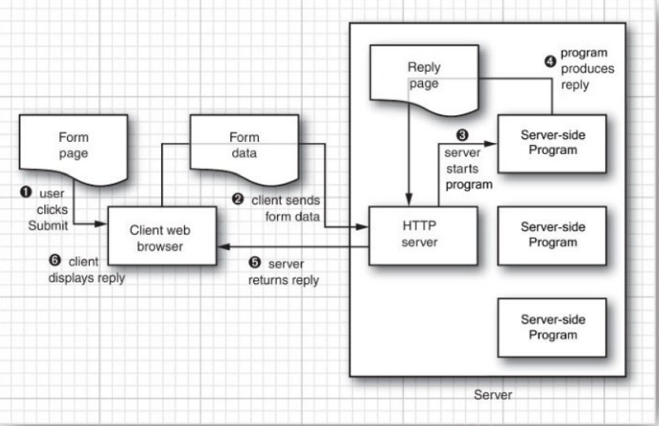

# 网络

## 连接到服务器
### 使用 telnet
telnet 是一种用于网络编程的非常强大的调试工具。

### 用 Java 连接到服务器
```
Socket s = new Socket("time-a.nist.gov", 13);
InputStream inStream = s.getInputStream();
```
第一行代码用于打开一个套接字(socket)。
套接字也是网络软件中的一个抽象概念，负责启动该程序内部和外部之间的通信。
将远程地址和端口号传递给套接字的构造器，
如果连接失败，将抛出一个 UnKnownHostException 异常；
如果存在其他问题，将抛出一个 IOException 异常。

一旦套接字被打开，java.net.Socket 类中的 getInputStream 方法就会返回一个 InputStream 对象。
该对象可以像其他任何流对象一样使用。

### 套接字超时
从套接字读取信息时，在有数据可供访问之前，读操作将会被阻塞。
如果此时主机不可达，那么应用要等待很长时间，并且因为受底层操作系统的限制而最终会导致超时。

对于不同的应用，应该确定合理的超时值
```
Socket s = new Socket(. . .);
// time out after 10 seconds
s.setSoTimeout(10000); 
```
如果已经为套接字设置了超时值，并且之后的读操作和写操作在没有完成之前就超时了，
那么就会抛出 SocketTimeoutException 异常。
可以捕获这个异常，并对超时做出反应。
```
try {
    InputStream in = s.getInputStream(); // read from in
    . . .
} catch (InterruptedIOException exception) {
    react to timeout
}
```

另外还有一个超时问题是必须解决的。下面这个构造器：
```
Socket(String host, int port)
```
会一直无限期地阻塞下去，知道建立了到达主机的初始连接为止。

可以通过先构建一个无连接的套接字，然后再使用一个超时来进行连接的方式解决这个问题。：
```
Socket s = new Socket();
s.connect(new InetSocketAddress(host, port), timeout);
```

### 因特网地址
> 如果需要在主机名和因特网地址之间进行转换，可以使用 InetAddress 类
```
/* java.net.InetAddress */

// 为给定的主机名创建一个 InetAddress 对象，
// 或者一个包含了该主机名所对应的所有因特网地址的数组
static InetAddress getByName(String host)
static InetAddress[] getAllByName(String host)

// 为本地主机创建一个 InetAddress 对象。
static InetAddress getLocalHost()

// 返回一个包含数字型地址的字节数组
byte[] getAddress()

// 返回一个由十进制数组成的字符串，各数字间用圆点符号隔开，
// 例如 "129.6.15.28"
String getHostAddress()

// 返回主机名
String getHostName()
```

## 实现服务器
### 服务器套接字
每个 web 服务器程序，都会不间断地执行下面这个循环：
1. 通过输入数据流从客户端接受一个命令("get me this information")
2. 解码这个客户端命令
3. 收集客户端所请求的信息
4. 通过输出数据流发送信息给客户端
```
/* java.net.ServerSocket */

// 创建一个监听端口的服务器套接字
ServerSocket(int port)

// 等待连接。
// 该方法阻塞当前线程直至建立连接为止。
// 该方法返回一个 Socket 对象，程序可以通过这个对象与连接中的客户端进行通信。
Socket accept()

// 关闭服务器
void close()
```

### 为多个客户端服务
可以使用多线程使服务器为多个客户端服务。
类似以下结构：
```
while (true) {
    Socket incoming = s.accept();
    Runnable r = new ThreadedEchoHandler(incoming);
    Thread t = new Thread(r);
    t.start();
}
```

### 半关闭
> The half-close allows one end of a socket connection to terminate its output while still
  receiving data from the other end.
```
/* java.net.Socket */

// 只关闭输出流
void shutdownOutput() 

// 之关闭输入流
void shutdownInput() 

// 如果输出已被关闭，则返回 true
boolean isOutputShutdown() 1.4

// 如果输入已被关闭，则返回 true
boolean isInputShutdown() 
```

## 可中断套接字
> When you connect to a socket, the current thread blocks until the connection has been
  established or a timeout has elapsed. Similarly, when you read or write data through a socket,
  the current thread blocks until the operation is successful or has timed out.
  
>In interactive applications, you would like to give users an option to simply cancel a socket
  connection that does not appear to produce results. However, if a thread blocks on an
  unresponsive socket, you cannot unblock it by calling interrupt.

为了实现套接字操作，可以使用 java.nio 包提供的一个特性 —— SocketChannel 类。
```
/* jave.net.InetSocketAddress */
// 用给定的主机和端口参数创建一个地址对象，并在创建过程中解析主机名。
// 如果主机名不能被解析，那么该地址对象的 unresolved 属性将被设为 true
InetSocketAddress(String hostname, int port)
// 如果不能解析该地址对象，则返回 true
boolean isUnresolved()

/* java.nio.channels.SocketChannel */
// 打开一个套接字通道，并将其连接到远程地址
static SocketChannel open(SocketAddress address)

/* java.nio.channels.Channels */
// 创建一个输入流，用以从指定的通道读取数据
static InputStream newInputStream(ReadableByteChannel channel)
// 创建一个输出流，用以向指定的通道写入数据
static OutputStream newOutputStream(WritableByteChannel channel)
```

## 获取 Web 数据
### URL 和 URI
    URI：统一资源标识符(Uniform Resource Identifier)
    URL：统一资源定位符(Uniform Resource Locator)
> URI 是单纯的语法结构，包含用来指定 Web 资源的字符串的各种组成部分。
  在 Java 类库中，URI 类的唯一作用就是解析，不包含任何用于访问资源的方法。

一个 URI 具有以下句法：
```
// [...] 表示可选部分
[scheme:]schemeSpecificPart[#fragment]
```
包含 `scheme:` 部分的 URI 称为绝对 URI。否则，称为相对 URI。

如果绝对 URI 的 schemeSpecificPart 不是以 / 开头的，我们就称它为不透明的。
例如：
```
mailto:cay@horstmann.com
```
所有透明的绝对 URI 和所有相对 URI 都是分层的(hierarchical)。
例如：
```
http://horstmann.com/index.html
../../java/net/Socket.html#Socket()
```
一个分层 URI 的 schemeSpecificPart 具有以下结构：
```
[//authority][path][?query]
```
对于基于服务器的 URI，authority 部分具有以下形式：
```
// port 必须是一个整数
[user-info@]host[:port]
```

URI 类的作用之一是解析标识符并将它分解成各种不同的组成部分。
```
getScheme
getSchemeSpecificPart
getAuthority
getUserInfo
getHost
getPort
getPath
getQuery
getFragment
```
URI 类的另一个作用是处理绝对标识符和相对标识符。
例如：
```
// 这是一个绝对 URI
http://docs.mycompany.com/api/java/net/ServerSocket.html

// 这是一个相对 URI
../../java/net/Socket.html#Socket()

// 这是它们组合出的绝对 URI
http://docs.mycompany.com/api/java/net/Socket.html#Socket()

combined = base.resolve(relative);
```
这个过程称为解析相对 URI

与此相反的过程称为相对化(relativization)。
例如：
```
// 这是一个绝对 URI
http://docs.mycompany.com/api

// 这是另一个绝对 URI
http://docs.mycompany.com/api/java/lang/String.html

// 生成的相对 URI
java/lang/String.html

relative = base.relativize(combined);
```

RUL 和 URLConnection 类封装了大量复杂的实现细节。
```
// 从一个字符串构建一个 URL 对象
URL url = new URL(urlString);
```
如果想要获得该资源的内容，可以使用 URL 类中的 openStream 方法。
该方法将产生一个 InputStream 对象，然后就可以按照一般的用法来使用这个对象了。
比如用它构建一个 Scanner 对象：
```
InputStream inStream = url.openStream();
Scanner in = new Scanner(inStream, "UTF-8");
```

### 使用 URLConnection 获取信息
> If you want additional information about a web resource, you should use the URLConnection
  class, which gives you much more control than the basic URL class.

当操作一个 URLConnection 对象时，必须像下面这样非常小心的地安排操作步骤：
1. 调用 URL 类中的 openConnection 方法获得 URLConnection 对象：
    ```
    URLConnection connection = url.openConnection();
    ```
2. 使用以下方法来设置任意的请求属性
    ```
    setDoInput
    setDoOutput
    setIfModifiedSince
    setUseCaches
    setAllowUserInteraction
    setRequestProperty
    setConnectTimeout
    setReadTimeout
    ```
3. 调用 connect 方法连接远程资源
    ```
   connection.connect();
    ```
   除了与服务器建立套接字连接外，该方法还可用于向服务器查询头信息(header information)
4. 与服务器建立连接后，可以查询头信息。
    getHeaderFieldKey 和 getHeaderField 这两个方法枚举了信息头的所有字段。
    getHeaderFields 方法返回一个包含了信息头中所有字段的标准 Map 对象。
    为了方便使用，以下方法可以查询各标准字段：
    ```
    getContentType
    getContentLength
    getContentEncoding
    getDate
    getExpiration
    getLastModified
    ```
5. 最后，访问资源数据。
    使用 getInputStream 方法获取一个输入流用于读取信息

### 提交表单数据


    在向 Web 服务器发送信息时，通常有两个命令会被用到：GET 和 POST
在使用 GET 命令时，只需将参数附在 URL 的结尾处即可。
这种 URL 的格式如下：
```
http://host/path?query
```
其中，每个参数都具有 “名字=值” 的形式，而这些参数之间用 & 字符分隔开。
参数的值遵循下面的规则，使用 URL 编码模式进行编码：
- 保留字符 A 到 Z、a 到 z、0 到 9，以及 . - ~ _。
- 用 + 字符替换所有空格
- 将其他所有字符编码为 UTF-8，并将每个字节都编码为 % 后面紧跟一个两位的十六进制数字。

> POST 请求经常用来处理具有大量数据的表单。
  在 POST 请求中，我们不会在 URL 上附着参数，
  而是从 URLConnection 中获得输入流，并将名 / 值对写入到该输出流中。
  我们任然需要对这些值进行 URL 编码，并用 & 字符将它们隔开。

在提交数据给服务器程序之前，首先需要创建一个 URLConnection 对象。
```
URL url = new URL("http://host/path");
URLConnection connection = url.openConnection();
```
然后，调用  setDoOutput 方法建立一个用于输出的连接。
```
connection.setDoOutput(true);
```
接着，连接 getOutputStream 方法获得一个流，可以通过这个流向服务器发送数据。
如果要向服务器发送文本信息，那么可以非常方便的将流包装在 PrintWriter 对象中。
```
PrintWriter out = new PrintWriter(connection.getOutputStream(), "UTF-8");

// Now you are ready to send data to the server:
out.print(name1 + "=" + URLEncoder.encode(value1, "UTF-8") + "&");
out.print(name2 + "=" + URLEncoder.encode(value2, "UTF-8"));
```
之后，关闭输出流
```
out.close();
```
最后，调用 getInputStream 方法读取服务器的响应。


> 在提交表达数据时，HTTP 头包含了类型和内容长度。
```
Content-Type: application/x-www-form-urlencoded
```
> POST 的头还必须包含内容长度
```
Content-Length: 124
```


## 发送 E-mail
