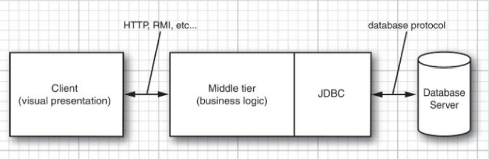
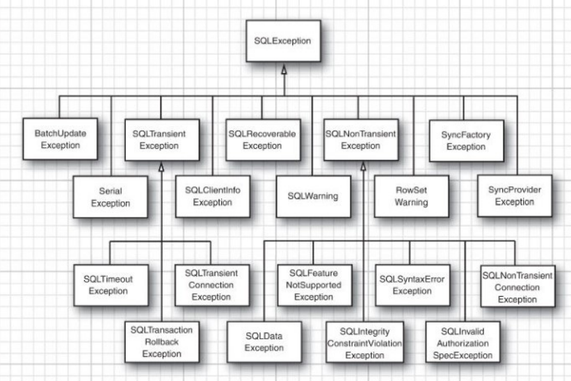

# 数据库编程
## JDBC 的设计
> Both JDBC and ODBC are based on the same idea: 
  Programs written according to the API talk to the driver manager,
  which, in turn, uses a driver to talk to the actual database.

### JDBC 驱动程序类型
JDBC 规范将驱动程序归结为以下几类：
- 第一类驱动程序将 JDBC 翻译成 ODBC，然后使用一个 ODBC 驱动程序与数据库进行通信。
- 第二类驱动程序是由部分 Java 程序和部分本地代码组成的，用于与数据库的客户端 API 进行通信。
- 第三类驱动程序是纯 Java 客户端类库，
  它使用一种与具体数据库无关的协议将数据库请求发送给服务器挂钩，
  然后该构件再将数据库请求翻译成数据库相关的协议。
- 第四类驱动程序是纯 Java 类库，它将 JDBC 请求直接翻译成数据库相关的协议。

JDBC 最终是为了实现以下目标：
- 通过使用标准的 SQL 语句，甚至是专门的 SQL 扩展，
  程序员就可以利用 Java 语言开发访问数据库的应用，同时还依旧遵守 Java 语言的相关约定。
- 数据库供应商和数据库工具开发商可以提供底层的驱动程序。
  因此，它们可以优化各自数据库产品的驱动程序。

### JDBC 经典用法
三层模型的优点：
它将可视化表示(位于客户端)从业务逻辑(位于中间层)和原始数据(位于数据库)中分离出来。



## 结构化查询语言

## JDBC 配置
### 数据库 URL
JDBC 使用了一种与普通 URL 类似的语法来描述数据源。
```
jdbc:subprotocol:other stuff
```
其中，subprotocol 用于选择连接到数据库的具体驱动程序。
other stuff 参数的格式随所使用的 subprotocol 不同而不同。

### 驱动程序 JAR 文件
[MySQL驱动器下载地址](https://dev.mysql.com/downloads/connector/j/)

### 启动数据库
### 注册驱动器类
### 连接到数据库
在 Java 程序中，我们可以使用如下代码打开一个数据库连接：
```
String url = "jdbc:postgresql:COREJAVA";
String username = "dbuser";
String password = "secret";
Connection conn = DriverManager.getConnection(url, username, password);
```

## 使用 JDBC 语句
### 执行 SQL 语句
在执行 SQL 语句之前，首先要创建一个 Statement 对象。
要创建 Statement 对象，需要使用调用 DriverManager.getConnection 方法所获得的 Connection 对象
```
Statement stat = conn.createStatement();
```
接着，把要执行的 SQL 语句放入字符串中，例如：
```
String command = "UPDATE Books"
+ " SET Price = Price - 5.00"
+ " WHERE Title NOT LIKE '%Introduction%'";
```
然后，调用 Statement 接口中的 executeUpdate 方法：
```
stat.executeUpdate(command);
```
executeUpdate 方法将返回受 SQL 语句影响的行数，或者对不返回行数的语句返回 0.

executeUpdate 方法既可以执行诸如 INSERT、UPDATE 和 DELETE 之类的操作，
也可以执行诸如 CREATE TABLE 和 DROP TABLE 之类的数据定义语句。
但是，执行 SELECT 查询时必须使用 executeQuery 方法。
另外，还有一个 execute 语句可以执行任意的 SQL 语句，此方法通常只用于由用户提供的交互式查询。

executeQuery 方法会返回一个 ResultSet 类型的对象，可以通过它来每次一行地迭代遍历所有查询结果。
```
ResultSet rs = stat.executeQuery("SELECT * FROM Books");
// 分析结果集时通常可以使用类似如下的循环语句代码。
while (rs.next()) {
    look at a row of the result set
}
```
> The iteration protocol of the ResultSet interface is subtly different from the protocol
  of the java.util.Iterator interface. Here, the iterator is initialized to a position before
  the first row. You must call the next method once to move the iterator to the first row.
  Also, there is no hasNext method; keep calling next until it returns false.

结果集中行的顺序是任意排列的。除非使用 ORDER BY 子句指定行的顺序，否则不能为行序强加任何意义。

查看每一行时，可能希望知道其中每一列的内容，有很多访问器(accessor)方法可以用于获取这些信息。
```
String isbn = rs.getString(1);
double price = rs.getDouble("Price");
```
不同的数据类型有不同的访问器，比如 getString 和 getDouble。
每个访问器都有两种形式：
一种接收数字型参数，指该数字所对应的列(数据库的序列号是从 1 开始计算的)。
另一种接收字符串参数，指的是结果集中以该字符串为列名的列。

### 管理连接、语句和结果集
> Every Connection object can create one or more Statement objects. You can use the same
  Statement object for multiple unrelated commands and queries. However, a statement has at
  most one open result set. If you issue multiple queries whose results you analyze concurrently,
  you need multiple Statement objects.

> When you are done using a ResultSet, Statement, or Connection, you should call the close
  method immediately. These objects use large data structures that draw on the finite resources
  of the database server.

> Use the try-with-resources block just to close the connection, and use a separate
  try/catch block to handle exceptions. Separating the try blocks makes your code easier
  to read and maintain.

### 分析 SQL 异常
每个 SQLException 都有一个由多个  SQLException 对象构成的链，这些对象可以通过 getNextException 方法获取。
这个异常链是每个异常都具有的由 Throwable 对象构成的“成因”链之外的异常链。




## 执行查询操作
### 预备语句

### 读写 LOB

### SQL 转义

### 多结果集

### 获取自动生成的键


## 可滚动和可更新的结果集
### 可滚动的结果集
### 可更新的结果集

## 行集
### 构建行集
### 被缓存的行集

## 元数据

## 事务
### 用 JDBC 对事务编程
### 保存点
### 批量更新

## 高级 SQL 类型

## Web 与企业应用中的连接管理


